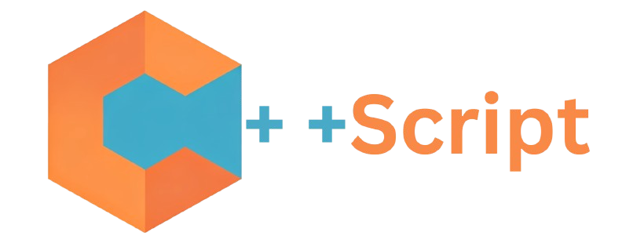

<h1 style="text-align: center;">CppScript</h1>

Cppscript is a powerful, high-performance language designed to provide a C++-like experience, while seamlessly compiling into optimized JavaScript code.

### License:

We use the GNU gpl v3 license.
For legal queries- harshabhattacharyya510@duck.com 

### Languages:

C++ and NodeJs is welcome.
Typescript and python is allowed but you'll have to maintain it yourself.

### Development:

We use the Agile methodologie of Kanban.
Use todos like a Kanban board.

### Dev phase:

It is not ready yet but will be in the near future. With your help we can finish the project sooner.
Current phase : lexer

### Installation:

Required: clang && make

install command: <tt>make install && ./cpps</tt>

#                THANKS!
